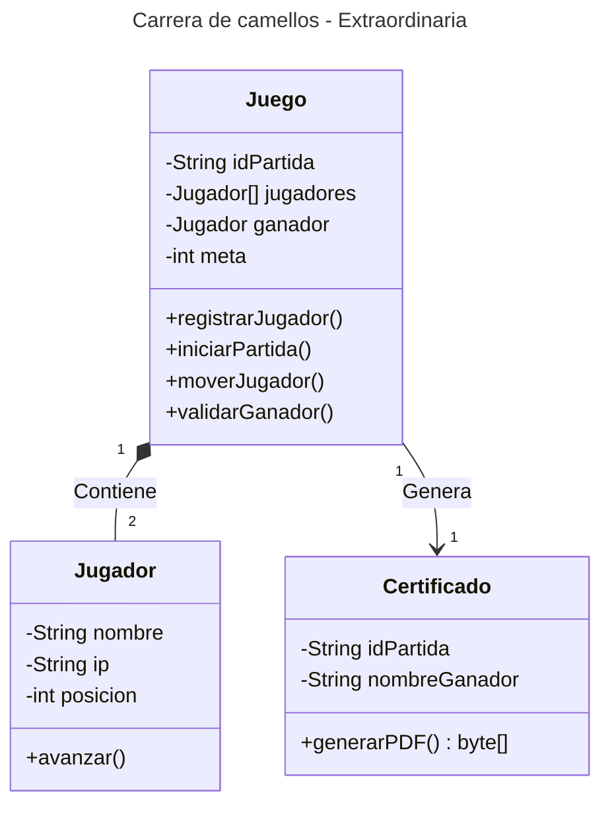
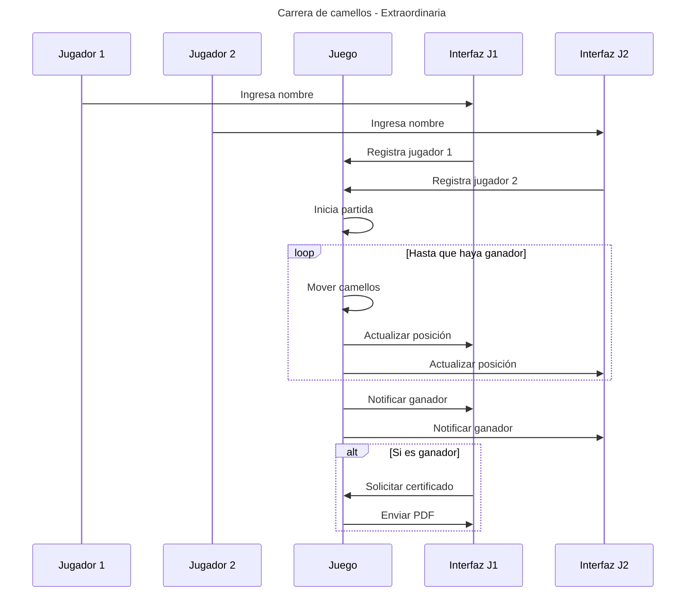

# Carrera de Camellos: Análisis y Prototipo
## **Diagrama de clase**

## **Diagrama de secuencia**

# Plan de Pruebas

## 1. Pruebas del Juego
| Prueba          | Cómo probarlo                          | Resultado esperado                  |
|---------------------|----------------------------------------|--------------------------------------|
| Registrar jugadores | 1. Ingresar nombre del jugador 1 2. Ingresar nombre del jugador 2 | El juego se debe iniciar cuando hay 2 jugadores |
| Movimientos del jugador | Ver posición en pantalla | La posición del jugador aumenta (ej: de 0 a 3) |
| Detectar al ganador | Mover al jugador hasta pasar la meta | Muestra: "¡Ganaste!" y el botón para generar PDF |

## 2. Pruebas del Certificado
| Qué probar          | Cómo probarlo                          | Resultado esperado                  |
|---------------------|----------------------------------------|--------------------------------------|
| Generar el PDF   | 1. Ganar una partida 2. Hacer clic en "Generar certificado" | Se descarga el `certificado_ganador.pdf` |
| Contenido del PDF   | Abrir el PDF | El PDF muestra: - Nombre del ganador - ID de la partida |

## 3. Pruebas de Errores
| Qué probar          | Cómo probarlo                          | Resultado esperado                  |
|---------------------|----------------------------------------|--------------------------------------|
| Registro inválido   | Intentar iniciar con 1 jugador | Muestra: "Se necesitan 2 jugadores" |
| Nombre vacío        | Registrar jugador sin nombre | Muestra: "Ingresa un nombre válido" |
| Desconexión     | Durante la partida, apagar red de un jugador | Muestra: "Partida cancelada - Jugador desconectado, no hay ganador |
