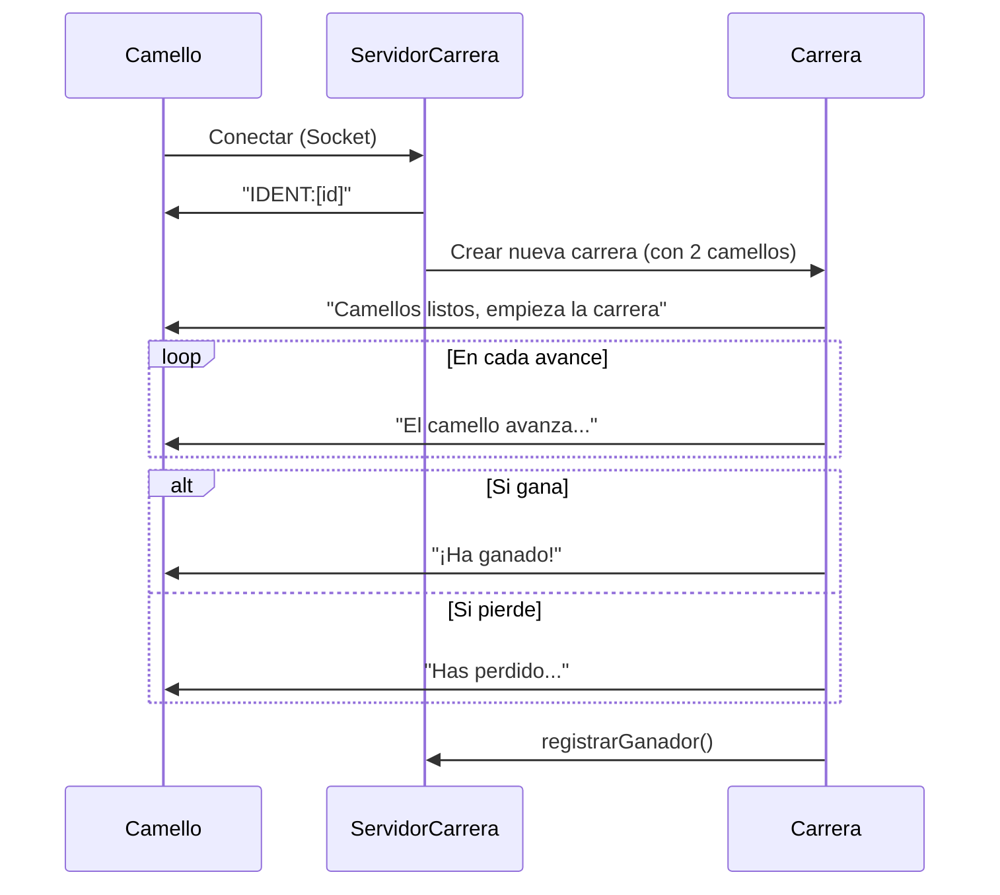
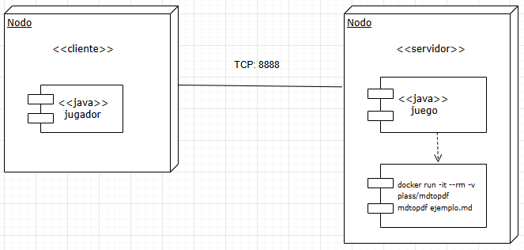
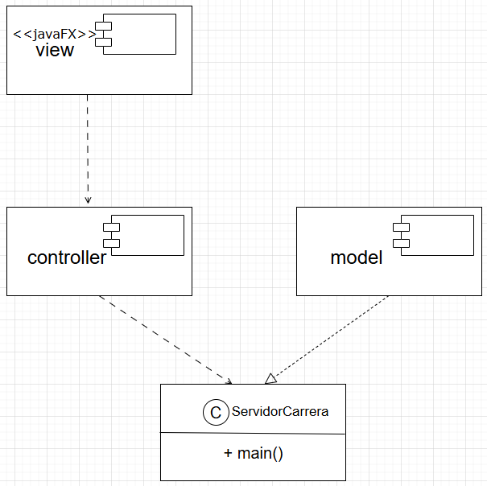

## 1. Análisis / Diagrama de secuencia

## 2. Arquitectura
El proyecto cuenta con un Cliente - Servidor y se organiza en paquetes con el patrón MVC:

**ServidorCarrera.java:**  
Mediante **sockets TCP** acepta conexiones de clientes, asigna IDs únicos y gestiona el inicio de carreras con hilos independientes por carrera.

**App.java:**  
JavaFX con la interfaz gráfica. Se conecta al servidor, recibe su ID y participa en carreras.

**GestorCarreras.java:**  
Administra el registro y almacenamiento de los resultados en un archivo de texto (`registro_carreras.txt`).

**Carrera.java:**  
Gestiona la lógica de la carrera: avance de camellos y la comunicación con clientes.

---

## 3. Diseño

### Diagrama de Despliegue

### Diagrama de Componentes

---

## 4. Plan de pruebas
- **Prueba de conexión:**  
  Verificar que clientes reciben IDs únicos al conectarse.
- **Prueba de carrera:**  
  Comprobar el desarrollo correcto de la carrera.
- **Prueba de persistencia:**  
  Validar actualización adecuada de `registro_carreras.txt` al acabar la carrera (se actualiza por ejecución).
- **Prueba de concurrencia:**  
  Iniciar carreras paralelas entre ellas.

---

## 5. Desarrollo
- **Tecnologías:** Java 22 y JavaFX para interfaces gráficas
- **Gestión de dependencias:** Maven Daemon (`mvnd`) / (`mvn`)
- **Ejecución:** Automatizada mediante script `iniciar_carrera.bat` / Iniciando clase `ServidorCarrera.java` y dos `App.java` por carrera.
- **Organización:** Paquetes MVC
