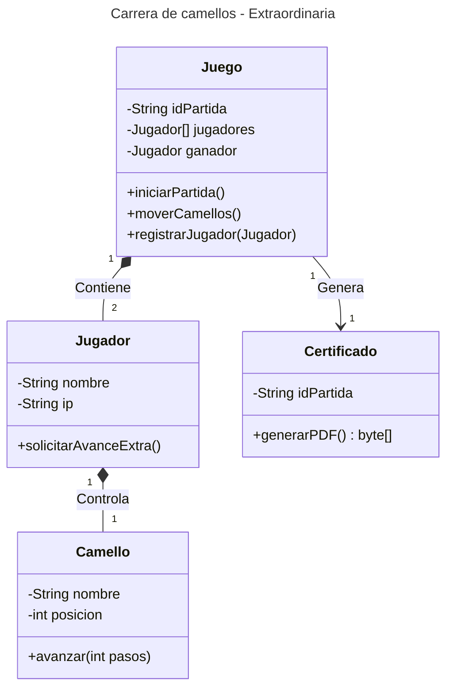
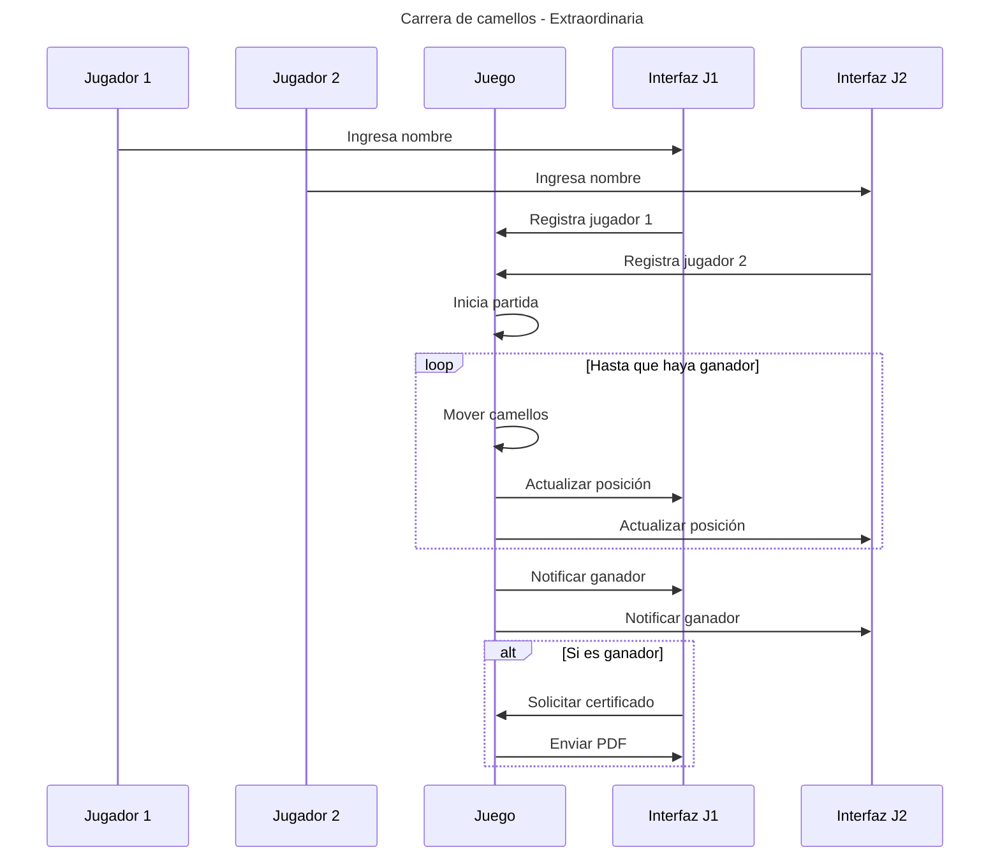

# Carrera de Camellos: Análisis y Prototipo
## **Diagrama de clase**

## **Diagrama de secuencia**

## **Anotaciones**
1. **Diagrama de clase**:
El método solicitarAvancesExtra() de la clase Jugador no es definitivo, si el desarrollo se complica no se incluirá.
No me queda claro si las clases camello y certificado son realmente necesarias, ya que en el caso de la clase camellos al tener jugadores creo que sería suficiente, pero las he incluido esperando Feedback.
